<div align="center">

<h3><code>eduardoruisjbv@github ~ $ ./contributions --year</code></h3>



<br><br>

<h3><code>eduardoruisjbv@github ~ $ whoami</code></h3>

<table>
  <tr>
    <td valign="top"></td>
    <td valign="top"></td>
  </tr>
</table>

<br>

<p><b>AI Systems &amp; Product Engineer</b></p>

[](https://eduardorui.com.br/)
[](https://github.com/eduardoruisjbv)

</div>

## Refresh the profile art

The contribution graph updates daily through GitHub Actions. To regenerate the avatar art after changing `source-photo.jpg`, install the dependencies and run:

```sh
python -m venv .venv
source .venv/bin/activate
pip install -r scripts/requirements.txt
python scripts/prep_photo.py
python scripts/make_ascii_svg.py
python scripts/make_info_card.py
```

The daily job only needs the public GitHub contributions page; it uses no personal access token.
