<h1>Rui</h1>

<strong>AI Systems &amp; Product Engineer | DevOps | World of Warcraft Add-on Developer</strong>

I build practical tools for developer workflows, Linux services, and WoW players. My work spans product engineering and DevOps, with a focus on clear interfaces, reliable automation, and systems that are straightforward to operate.

<a href="https://eduardorui.com.br/">Portfolio</a> | <a href="https://www.curseforge.com/members/vonkoenig_rui/projects">World of Warcraft add-ons</a>

## Selected work

- **[DaylightDDC](https://github.com/eduardoruisjbv/DaylightDDC)**: A location-aware lighting scheduler for Linux monitors. It uses geographic coordinates and the solar cycle to adapt brightness throughout the day, bringing an ambient-light style experience to external displays through DDC/CI, with optional daylight-aware profiles and GNOME controls.
- **World of Warcraft add-ons:** [BagMemory](https://github.com/eduardoruisjbv/BagMemory) protects valuable items; [MuscleMemory](https://github.com/eduardoruisjbv/MuscleMemory) suggests role-aware ability mappings and keeps manual choices in the player's hands; [MythicView](https://github.com/eduardoruisjbv/MythicView) adds a cinematic camera that accounts for combat, groups, and flight.
- **[BTKVM](https://github.com/eduardoruisjbv/btkvm):** A vision for an Apple-like continuity layer across Android devices, connecting phones, tablets, and PCs through shared input, audio, and seamless handoff.

## Terminal profile

<table>
  <tr>
    <td valign="top"><picture><source media="(prefers-color-scheme: dark)" srcset="./avatar-ascii.svg"><source media="(prefers-color-scheme: light)" srcset="./avatar-ascii-light.svg"></picture></td>
    <td valign="top"><picture><source media="(prefers-color-scheme: dark)" srcset="./rui-profile-card.svg"><source media="(prefers-color-scheme: light)" srcset="./rui-profile-card-light.svg"></picture></td>
  </tr>
</table>

## Activity

<picture>
  <source media="(prefers-color-scheme: dark)" srcset="./contrib-heatmap.svg">
  <source media="(prefers-color-scheme: light)" srcset="./contrib-heatmap-light.svg">
  
</picture>
